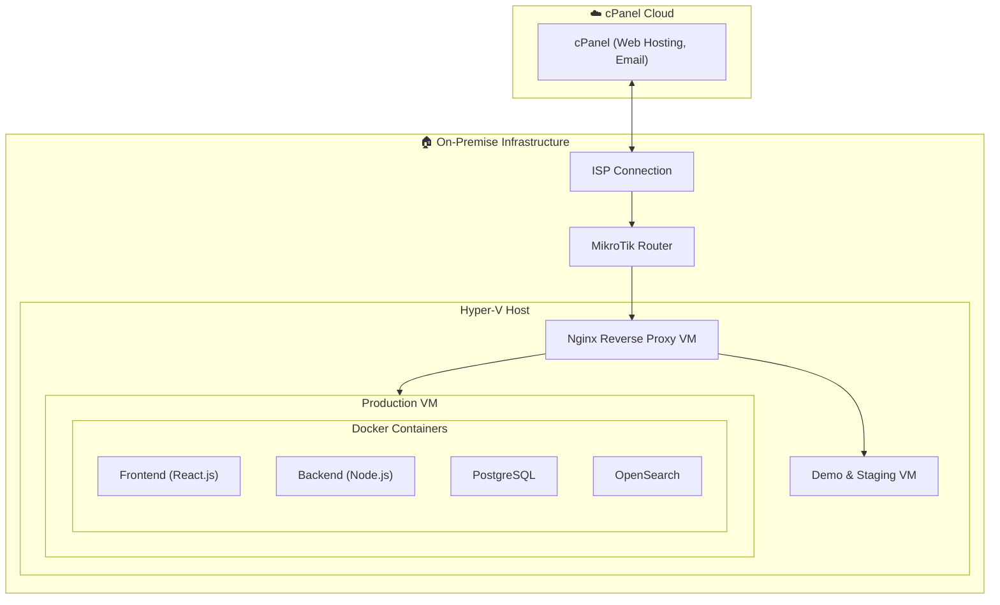

# 📌 Assisteprint Portal

_Business management platform for printing services_

---

## 🌐 Demo

-   🚀 **Live Demo**: [demo.assisteprint.com](https://demo.assisteprint.com)
-   🔑 **Demo Access**:
    -   Admin:
        -   demo@assisteprint.com
        -   admin1234
    -   Staff:
        -   ...
        -   ...
    -   User
        -   ...
        -   ...

---

## 🚀 Overview

The **Assisteprint Portal** is a web platform built to help streamline company operations.  
It centralizes contract management, copy counts, invoicing, and reporting — reducing manual work and improving efficiency.

---

## ✨ Key Aspects

-   🔐 **Role-based access control (RBAC)** — secure and granular permissions (admin, staff, user)
-   💰 **Sage integration** — automated invoicing to reduce errors and save time
-   📊 **Dashboards & reports** — real-time insights into contracts, machines, and profitability

---

## 🛠️ Tech Stack

-   **Frontend**: React / RTK Query / Chakra UI
-   **Backend**: Node.js / Express
-   **Database**: PostgreSQL
-   **Other**: Docker / Nginx / OpenSearch / cPanel

---

## Architecture

-   mermaid image

## 👤 Author

**Diogo Cunha**

-   📧 diocunha@outlook.pt
-   💼 [LinkedIn](https://www.linkedin.com/in/diogo-cunha-a86185177/)

